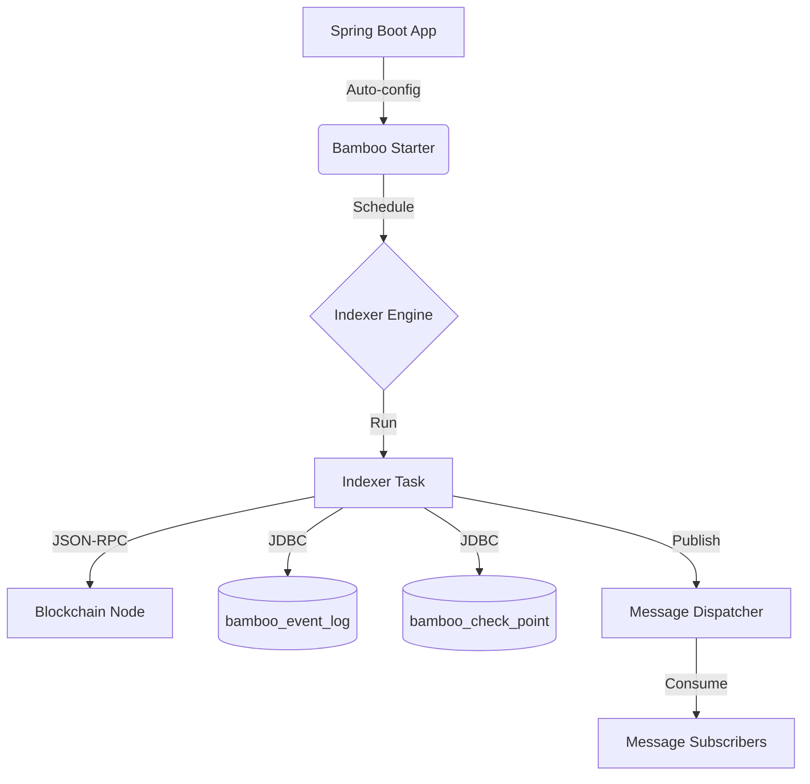

# Architecture

Bamboo is a lightweight, embedded indexer that runs inside your Spring Boot process. It relies on JDBC for persistence and Web3j for JSON-RPC access.

## High-Level Design

## Core Flow

1. **Read checkpoint**: `IndexerTask` loads the latest block height for the configured chain ID.
2. **Compute range**: `fromBlock` to `fromBlock + stepBlocks` (clamped to the latest chain height).
3. **Fetch logs**: `RpcManager` uses Web3j `eth_getLogs` with configured contract addresses.
4. **Filter logs**: `EventLogFilter` matches logs against configured `signature-hash` values.
5. **Persist**: `JdbcEventLogDao` writes logs and `JdbcCheckPointDao` updates checkpoint in a single transaction.
6. **Dispatch**: `MessageDispatcher` publishes each stored `EventLog` to subscribers.

## Transaction Boundary

Log persistence and checkpoint updates are executed in a single JDBC transaction:

- `JdbcEventLogDao.writeAll(...)` inserts logs.
- `JdbcCheckPointDao.modify(...)` updates the checkpoint.

This ensures the checkpoint does not advance if log persistence fails.

## Persistence Model

- **Checkpoints**: `bamboo_check_point` stores `chain_id`, `block_height`, timestamps.
- **Event Logs**: `bamboo_event_log` stores raw log data plus the `removed` flag.
- **Schema Initialization**: `DefaultSchemaInitializer` executes SQL from bundled schema files (MySQL/PostgreSQL).

## Deployment Notes

- **Single instance per chain ID**: There is no distributed lock or sharding built in.
- **Reorg handling**: Logs include the `removed` flag, but reorg reconciliation is not automated.
- **Retry policy**: RPC calls include basic retry with fixed delay.

> [!WARNING]
> Run only one indexer instance per chain ID to avoid checkpoint races and duplicate writes.
